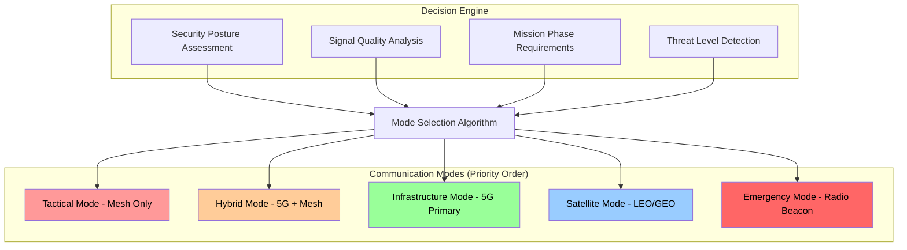
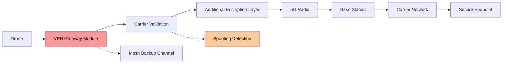
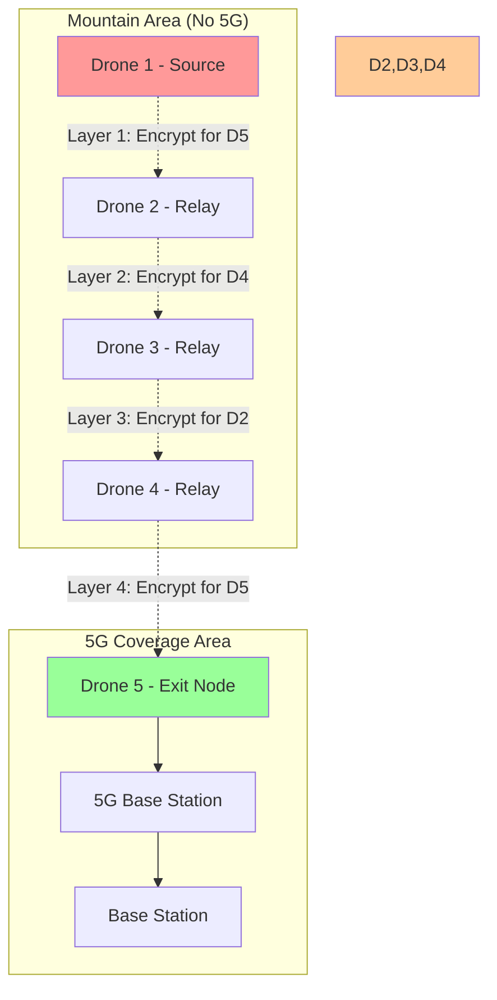
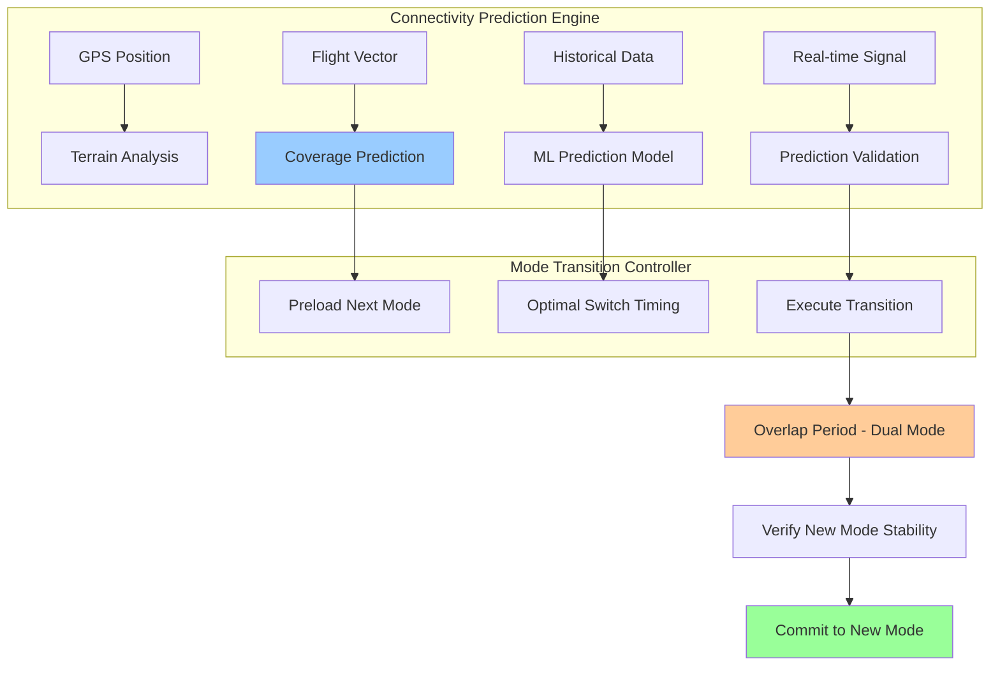
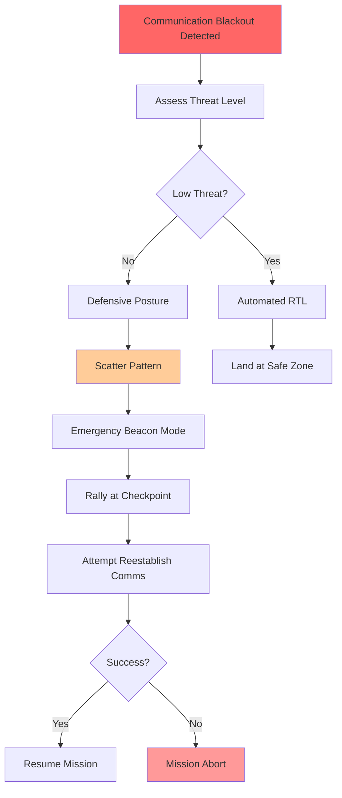
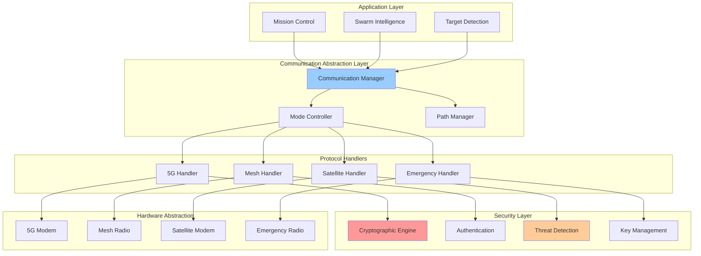

# Cerberus v0.3 - Hybrid 5G/Mesh Architecture
*Multi-Modal Communication with Seamless Failover*

## Executive Summary

This architecture addresses the critical challenge of operating drone swarms across areas with varying connectivity - from 5G-enabled urban areas to remote mountain regions with no infrastructure. The system implements **adaptive communication modes** with seamless failover and maintains security posture across all scenarios.

**Key Innovation: Gradient Connectivity Model**
Instead of binary 5G/mesh switching, we implement a gradient model that dynamically adapts to signal strength, latency, and security requirements.

---

## 1. Critical Loopholes in Original 5G+Mesh Approach

### 🔴 **Attack Surface Explosion**
- **5G Basestation Spoofing**: Fake base stations can capture all drone traffic
- **IMSI Catching**: Device identities exposed to surveillance equipment
- **Protocol Downgrade Attacks**: Force drones to use weaker encryption
- **Traffic Analysis**: 5G metadata reveals mission patterns even if encrypted

### 🔴 **Operational Failures**
- **Mode Switch Vulnerability**: Attack window during 5G→mesh transition
- **Inconsistent Security Models**: Different encryption/auth between modes
- **Data Hop Corruption**: Multi-hop routing through untrusted relay devices
- **Timing Attacks**: Predictable communication patterns based on geography

### 🔴 **Infrastructure Dependencies**
- **Carrier Network Compromise**: Nation-state actors control telecom infrastructure
- **Emergency Service Conflicts**: 5G networks prioritize emergency services
- **Bandwidth Throttling**: Carriers can limit drone traffic during peak usage
- **Geographic Blackouts**: Targeted infrastructure attacks or natural disasters

---

## 2. New Architecture: Adaptive Multi-Modal Communications

### 2.1. Communication Mode Hierarchy



### 2.2. Adaptive Communication Matrix

| Scenario | Primary | Secondary | Tertiary | Security Level |
|----------|---------|-----------|----------|----------------|
| **Urban Friendly** | 5G | Mesh | Satellite | Standard |
| **Urban Contested** | Mesh | Satellite | 5G (VPN) | High |
| **Rural Friendly** | Satellite | 5G | Mesh | Standard |
| **Rural Contested** | Mesh | Satellite | None | Maximum |
| **Mountain/Remote** | Mesh | Satellite | Long-Range Radio | High |
| **Emergency RTL** | All Available | Beacon | None | Minimal |

---

## 3. Security-First 5G Integration

### 3.1. Hardened 5G Implementation

**Problems with Standard 5G:**
```yaml
Standard 5G Issues:
  - IMSI exposed during attachment
  - Vulnerable to fake base stations
  - Carrier can decrypt metadata
  - No end-to-end authentication
  - Susceptible to jamming
```

**Our Hardened Solution:**


**Security Layers:**
1. **IMSI Privacy**: Rotating pseudonymous identifiers
2. **Base Station Authentication**: Cryptographic verification of legitimate towers
3. **Double Encryption**: Our crypto layer over 5G encryption
4. **Traffic Obfuscation**: Dummy traffic to hide mission patterns
5. **Carrier Validation**: Real-time verification of network infrastructure

### 3.2. 5G Module Security Hardening

```c++
class Secure5GModule {
private:
    HSM* security_module;
    CryptoEngine* crypto;
    ThreatDetector* ids;
    
public:
    bool validateBaseStation(BaseStationInfo bs) {
        // Cryptographic proof of legitimate infrastructure
        if (!crypto->verifyCarrierCertificate(bs.certificate)) {
            logThreat("FAKE_BASESTATION", bs.cell_id);
            return false;
        }
        
        // Signal fingerprinting
        if (!validateRFFingerprint(bs.signal_pattern)) {
            logThreat("BASESTATION_SPOOFING", bs.cell_id);
            return false;
        }
        
        // Geographic validation
        if (!validateGeographicConsistency(bs.location)) {
            logThreat("IMPOSSIBLE_BASESTATION_LOCATION", bs.cell_id);
            return false;
        }
        
        return true;
    }
    
    void establishSecureConnection() {
        // Layer 1: Standard 5G encryption
        establish5GConnection();
        
        // Layer 2: VPN tunnel through carrier network
        establishVPNTunnel();
        
        // Layer 3: Our end-to-end encryption
        establishE2EEncryption();
        
        // Layer 4: Traffic obfuscation
        startTrafficObfuscation();
    }
};
```

---

## 4. Intelligent Multi-Hop Relay Architecture

### 4.1. Secure Relay Node Design

**Problem with Simple Relaying:**
- Relay nodes can read/modify all traffic
- No authentication of relay capabilities
- Single point of failure in relay chain
- No protection against malicious relays

**Solution: Onion Routing for Drones**



**Layered Encryption:**
```python
def create_onion_packet(message, relay_path, destination):
    packet = message
    
    # Encrypt for destination first
    packet = encrypt(packet, destination.public_key)
    
    # Then encrypt for each relay in reverse order
    for relay in reversed(relay_path):
        packet = encrypt(packet, relay.public_key)
        packet = add_routing_header(packet, next_hop=relay)
    
    return packet

def relay_packet(encrypted_packet, my_private_key):
    # Decrypt outer layer only
    inner_packet = decrypt(encrypted_packet, my_private_key)
    
    # Extract next hop (can't see final destination)
    next_hop = extract_next_hop(inner_packet)
    
    # Forward without knowing contents or ultimate destination
    forward_to(inner_packet, next_hop)
```

### 4.2. Dynamic Relay Path Selection

**Multi-Path Routing:**
- Calculate 3+ independent paths to 5G coverage
- Route different message types on different paths
- Real-time path quality assessment
- Automatic path switching on compromise detection

```python
class RelayPathManager:
    def select_optimal_paths(self, destination_area):
        all_paths = self.calculate_all_possible_paths(destination_area)
        
        # Score paths based on multiple criteria
        scored_paths = []
        for path in all_paths:
            score = self.calculate_path_score(path)
            scored_paths.append((path, score))
        
        # Select top 3 paths with minimal overlap
        return self.select_diverse_paths(scored_paths, count=3)
    
    def calculate_path_score(self, path):
        return (
            path.reliability * 0.3 +        # Historical success rate
            path.security_level * 0.25 +    # Trust score of relay nodes
            (1/path.latency) * 0.2 +        # Speed (inverse of latency)
            path.bandwidth * 0.15 +          # Available throughput
            (1/path.hop_count) * 0.1        # Fewer hops preferred
        )
```

---

## 5. Seamless Mode Switching

### 5.1. Predictive Connectivity Mapping

**Problem**: Reactive switching creates vulnerabilities during transition

**Solution**: Predictive switching with overlap periods



**Predictive Algorithm:**
```python
def predict_connectivity_transition(current_position, flight_vector):
    # Look ahead 30 seconds of flight
    future_positions = extrapolate_flight_path(current_position, flight_vector, 30)
    
    connectivity_forecast = []
    for pos in future_positions:
        signal_strength = terrain_model.predict_5g_strength(pos)
        mesh_density = count_nearby_drones(pos, radius=2000)
        
        forecast = {
            'position': pos,
            '5g_signal': signal_strength,
            'mesh_nodes': mesh_density,
            'recommended_mode': select_optimal_mode(signal_strength, mesh_density)
        }
        connectivity_forecast.append(forecast)
    
    # Detect mode transitions
    transitions = detect_mode_changes(connectivity_forecast)
    
    # Prepare for upcoming transitions
    for transition in transitions:
        if transition.time_to_switch < 15:  # 15 second warning
            preload_communication_mode(transition.new_mode)
        
        if transition.time_to_switch < 5:   # 5 second execution
            initiate_mode_transition(transition.new_mode)
    
    return connectivity_forecast
```

### 5.2. Secure Mode Transition Protocol

**Overlap Period Security:**
```yaml
Transition Security Protocol:
  1. Pre-Transition (15s before):
     - Authenticate new communication channel
     - Establish encryption keys for new mode
     - Verify relay path availability
  
  2. Transition Period (5s overlap):
     - Send duplicate critical messages on both channels
     - Cross-validate message delivery
     - Monitor for interception attempts
  
  3. Post-Transition (10s after):
     - Verify new mode stability
     - Purge old channel credentials
     - Update routing tables
```

---

## 6. Advanced Threat Detection & Response

### 6.1. 5G-Specific Threat Detection

```c++
class G5ThreatDetector {
public:
    void monitor_network_anomalies() {
        // IMSI catcher detection
        if (detect_impossible_basestation_density()) {
            trigger_alert("IMSI_CATCHER_SUSPECTED");
            switch_to_mesh_mode();
        }
        
        // Downgrade attack detection
        if (encryption_strength_decreased()) {
            trigger_alert("PROTOCOL_DOWNGRADE_ATTACK");
            force_strongest_encryption();
        }
        
        // Traffic analysis detection
        if (unusual_latency_patterns()) {
            trigger_alert("TRAFFIC_ANALYSIS_DETECTED");
            activate_traffic_obfuscation();
        }
        
        // Fake basestation detection
        if (basestation_fingerprint_mismatch()) {
            trigger_alert("FAKE_BASESTATION");
            blacklist_basestation();
            fallback_to_backup_channel();
        }
    }
    
private:
    bool detect_impossible_basestation_density() {
        // Too many base stations in remote area = IMSI catcher
        int basestation_count = count_nearby_basestations(2000); // 2km radius
        return (basestation_count > expected_density_for_area() * 2);
    }
    
    bool basestation_fingerprint_mismatch() {
        // Verify RF characteristics match known good basestations
        RFFingerprint current = measure_current_basestation();
        RFFingerprint expected = lookup_legitimate_basestation();
        
        return (fingerprint_similarity(current, expected) < 0.8);
    }
};
```

### 6.2. Relay Chain Integrity Monitoring

**Proof-of-Relay Protocol:**
```python
def verify_relay_integrity(relay_path, test_message):
    """Cryptographically verify that relay nodes are behaving correctly"""
    
    # Create test message with verifiable properties
    test_packet = create_test_packet(
        content=generate_random_payload(),
        proof=create_relay_proof_requirement()
    )
    
    # Send through relay chain
    start_time = time.now()
    send_via_relay_path(test_packet, relay_path)
    
    # Each relay must provide proof of correct forwarding
    relay_proofs = collect_relay_proofs(relay_path, timeout=10)
    
    # Verify cryptographic proofs
    for i, (relay, proof) in enumerate(zip(relay_path, relay_proofs)):
        if not verify_relay_proof(relay, proof, test_packet):
            mark_relay_as_compromised(relay)
            recalculate_relay_paths(exclude=[relay])
            return False
    
    # Verify end-to-end timing
    end_time = time.now()
    expected_latency = sum(r.expected_latency for r in relay_path)
    
    if (end_time - start_time) > expected_latency * 1.5:
        # Someone is doing deep packet inspection or other delays
        investigate_relay_chain_delay(relay_path)
        return False
    
    return True
```

---

## 7. Emergency Failsafe Systems

### 7.1. Communication Blackout Protocols

**Scenario**: All communication methods compromised or unavailable



**Emergency Beacon Protocol:**
```c++
void activate_emergency_beacon() {
    // Switch to simple, hard-to-jam modulation
    radio.set_modulation(FSK_MODE);
    radio.set_frequency(EMERGENCY_FREQ_433_MHZ);
    radio.set_power(MAX_LEGAL_POWER);
    
    // Broadcast basic status every 30 seconds
    EmergencyBeacon beacon = {
        .drone_id = my_drone_id,
        .gps_position = get_current_position(),
        .battery_level = get_battery_percentage(),
        .status = get_drone_status(),
        .timestamp = get_utc_time(),
        .signature = sign_with_emergency_key(above_fields)
    };
    
    // Frequency hopping to avoid jamming
    for (int i = 0; i < 5; i++) {
        radio.set_frequency(EMERGENCY_FREQ_BASE + (i * 25_KHZ));
        transmit(beacon);
        delay(1000);  // 1 second between frequencies
    }
}
```

### 7.2. Autonomous Recovery Protocols

**Self-Healing Network:**
- Automatic topology reconfiguration when nodes are lost
- Distributed consensus on new communication modes
- Progressive degradation rather than complete failure

**Recovery Decision Tree:**
```python
def autonomous_recovery_decision():
    battery_level = get_battery_percentage()
    distance_to_home = calculate_distance_to_home()
    threat_assessment = evaluate_current_threats()
    mission_criticality = get_mission_priority()
    
    if battery_level < 25:
        return "IMMEDIATE_RTL"
    
    elif threat_assessment == "HIGH" and mission_criticality != "CRITICAL":
        return "ABORT_MISSION"
    
    elif distance_to_home > safe_return_distance():
        return "FIND_SAFE_LANDING_ZONE"
    
    elif communication_blackout_duration() > 300:  # 5 minutes
        return "EMERGENCY_BEACON_MODE"
    
    else:
        return "CONTINUE_AUTONOMOUS_OPERATION"
```

---

## 8. Implementation Architecture

### 8.1. Modular Communication Stack



### 8.2. Configuration Management

**Adaptive Configuration:**
```yaml
# Dynamic configuration based on operational environment
communication_profiles:
  urban_friendly:
    primary_mode: "5G"
    security_level: "standard"
    encryption: "AES256"
    relay_hops: 1
    
  urban_contested:
    primary_mode: "mesh"
    security_level: "high"  
    encryption: "AES256+ChaCha20"
    relay_hops: 3
    traffic_obfuscation: true
    
  rural_remote:
    primary_mode: "mesh"
    secondary_mode: "satellite"
    security_level: "high"
    encryption: "AES256+ChaCha20"
    relay_hops: 5
    power_optimization: true
    
  emergency_rtl:
    primary_mode: "emergency_beacon"
    security_level: "minimal"
    encryption: "basic"
    broadcast_interval: 30
```

---

## 9. Performance Optimization

### 9.1. Bandwidth Management

**Intelligent Traffic Shaping:**
```c++
class BandwidthManager {
private:
    struct TrafficClass {
        MessageType type;
        int priority;
        int allocated_bandwidth_kbps;
        int current_usage_kbps;
    };
    
    std::vector<TrafficClass> traffic_classes = {
        {EMERGENCY_COLLISION, 0, 100, 0},      // Highest priority
        {FLIGHT_COMMANDS, 1, 200, 0},
        {STATUS_UPDATES, 2, 150, 0},
        {SENSOR_DATA, 3, 500, 0},
        {VIDEO_STREAM, 4, 1000, 0},            // Lowest priority
    };
    
public:
    bool can_send_message(MessageType type, int message_size_bytes) {
        auto& traffic_class = find_traffic_class(type);
        
        int required_bandwidth = calculate_bandwidth_requirement(message_size_bytes);
        
        if (traffic_class.current_usage_kbps + required_bandwidth > 
            traffic_class.allocated_bandwidth_kbps) {
            
            // Try to borrow from lower priority classes
            if (!borrow_bandwidth_from_lower_priority(type, required_bandwidth)) {
                return false;  // Drop message
            }
        }
        
        traffic_class.current_usage_kbps += required_bandwidth;
        return true;
    }
};
```

### 9.2. Latency Optimization

**Multi-Path Concurrent Transmission:**
- Send critical messages on multiple paths simultaneously
- First successful delivery cancels other attempts
- Reduces worst-case latency in multi-hop scenarios

**Predictive Path Pre-establishment:**
- Establish relay paths before they're needed
- Maintain hot-standby connections
- Zero-latency failover for critical communications

---

## 10. Testing & Validation

### 10.1. Security Testing Framework

**Adversarial Testing:**
```yaml
Red_Team_Scenarios:
  5G_Attacks:
    - IMSI_catcher_deployment
    - Fake_basestation_setup
    - Protocol_downgrade_attacks
    - Traffic_analysis_attempts
    
  Mesh_Network_Attacks:
    - Malicious_relay_injection
    - Traffic_modification_attempts
    - Denial_of_service_attacks
    - Routing_table_poisoning
    
  Physical_Attacks:
    - Drone_capture_scenarios
    - Radio_jamming_across_bands
    - GPS_spoofing_attempts
    - Hardware_tampering
    
  Combined_Attacks:
    - Multi_vector_simultaneous
    - Persistent_advanced_threats
    - Supply_chain_compromise
    - Insider_threat_simulation
```

### 10.2. Field Testing Requirements

**Progressive Testing:**
1. **Lab Environment**: Controlled RF environment, simulated threats
2. **Limited Field**: Short-range, friendly environment
3. **Extended Field**: Long-range, multiple terrain types
4. **Adversarial Field**: Red team exercises, contested environment
5. **Operational Validation**: Real-world mission scenarios

---

## 11. Operational Procedures

### 11.1. Pre-Mission Checklist

```yaml
Communication_System_Checks:
  Hardware:
    - 5G module functionality test
    - Mesh radio calibration
    - Satellite modem GPS lock
    - Emergency radio beacon test
    
  Software:
    - Encryption key validation
    - Certificate chain verification
    - Threat detection system active
    - Mode switching logic test
    
  Network:
    - 5G carrier authentication
    - Mesh network topology mapping
    - Relay path calculation
    - Emergency frequency clear
    
  Security:
    - HSM functionality verified
    - Secure boot chain intact
    - Intrusion detection active
    - Incident response procedures loaded
```

### 11.2. Mission Monitoring

**Real-Time Dashboards:**
- Communication mode status per drone
- Signal strength and quality metrics
- Threat detection alerts
- Bandwidth utilization
- Relay path health
- Security incident timeline

---

## 12. Regulatory Compliance

### 12.1. Spectrum Management

**Multi-Band Coordination:**
- 5G: Licensed spectrum, carrier agreements required
- 2.4GHz: ISM band, power limitations
- 915MHz: Regional variations in power/bandwidth
- 433MHz: Emergency use, international coordination
- Satellite: ITU coordination, licensing requirements

### 12.2. Export Control Compliance

**Technology Classification:**
- Encryption: ITAR/EAR Category XIII(b)
- Communications: Dual-use technology review
- AI/ML: Emerging technology controls
- Integration: System-level classification

---

## Conclusion

This hybrid architecture solves the critical problems with the original 5G+mesh approach:

**Security Improvements:**
- ✅ Eliminates 5G-specific attack vectors through hardening
- ✅ Provides secure multi-hop relaying with onion routing
- ✅ Implements predictive threat detection and response
- ✅ Maintains security posture across all communication modes

**Operational Improvements:**
- ✅ Seamless mode switching with predictive algorithms
- ✅ Graceful degradation under attack or failure
- ✅ Autonomous recovery without human intervention
- ✅ Real-time adaptation to changing environments

**Technical Improvements:**
- ✅ Optimized bandwidth allocation per message priority
- ✅ Multi-path redundancy for critical communications
- ✅ Hardware-rooted security across all modes
- ✅ Comprehensive monitoring and alerting

**The Result:** A communication system that works reliably from dense urban environments to remote mountain regions, maintaining security and operational capability even under sophisticated attack.

This isn't just a fallback system - it's an intelligent, adaptive communication fabric that optimizes itself for every operational scenario.
