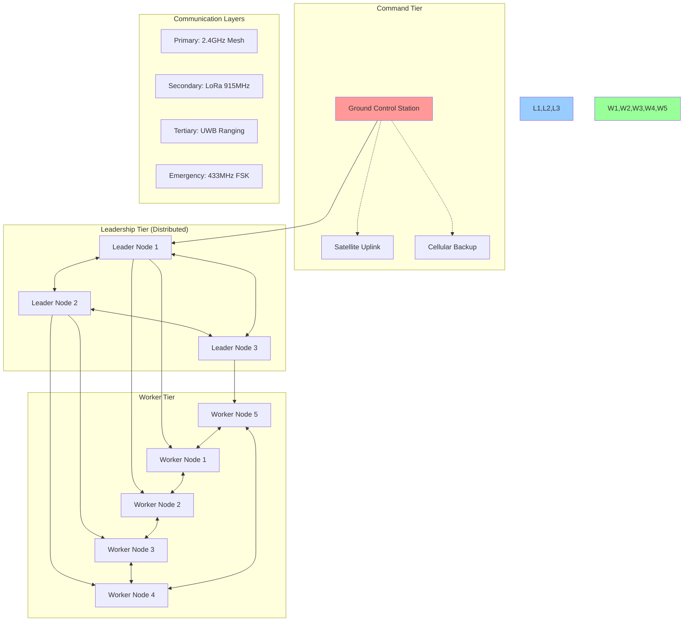
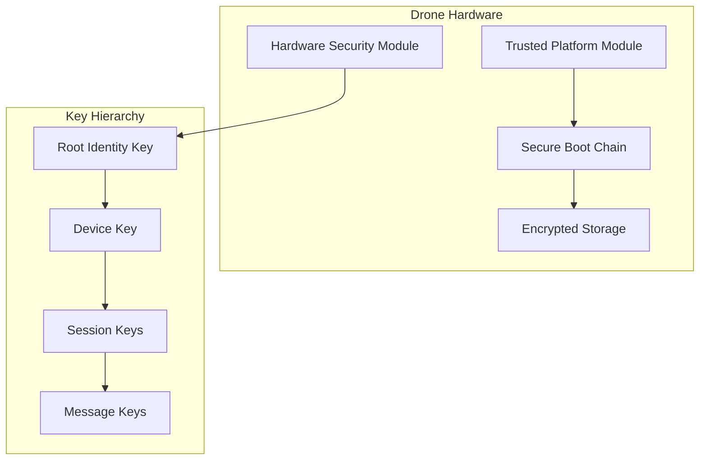
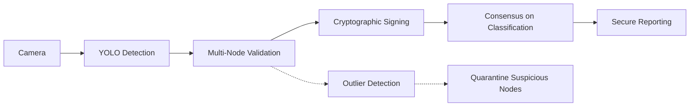
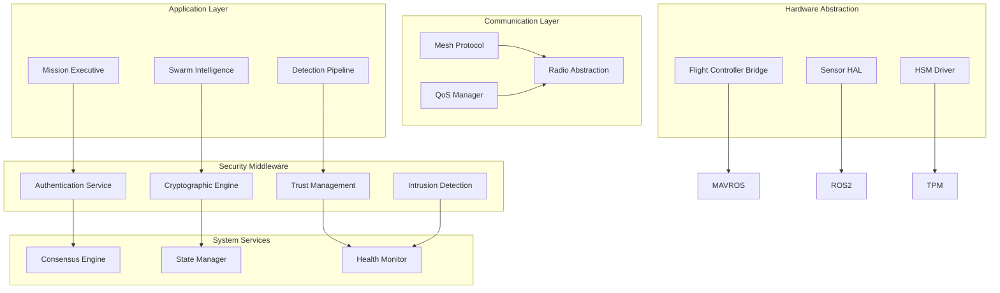

# Cerberus v0.2 - Production Architecture

## Executive Summary

This is a complete architectural overhaul addressing critical security, reliability, and operational concerns in the original design. The new architecture implements a **zero-trust, fault-tolerant, multi-layer defense system** with no single points of failure.

**Key Improvements:**
- Distributed consensus-based leadership
- Hardware-rooted security with HSMs
- Multi-band redundant communications
- Real-time safety-critical message prioritization
- Byzantine fault tolerance
- Comprehensive intrusion detection

---

## 1. Core Architectural Principles

### 1.1. Design Philosophy
```
SAFETY → SECURITY → MISSION SUCCESS
```

1. **Safety First**: Flight safety overrides all other concerns
2. **Zero Trust**: Every message, every node, every decision is verified
3. **Graceful Degradation**: System remains functional with 50% node loss
4. **Real-Time Guarantees**: Critical messages have bounded delivery times
5. **Defense in Depth**: Multiple independent security layers

### 1.2. Threat Model
- **Nation-state adversaries** with signal intelligence capabilities
- **Physical capture** of individual drones
- **Supply chain attacks** on hardware/software
- **Jamming and spoofing** of communication channels
- **Adversarial ML attacks** on detection systems

---

## 2. System Architecture Overview

### 2.1. Network Topology



### 2.2. Node Classification

**Leadership Nodes (3-5 nodes):**
- Run distributed consensus (RAFT)
- Make tactical decisions
- Coordinate worker nodes
- Higher compute/memory resources

**Worker Nodes:**
- Execute assigned tasks
- Report sensor data
- Follow leader instructions
- Lower resource requirements

**Floating Leadership:**
Any worker can become a leader based on:
- Compute resources available
- Network centrality
- Mission criticality
- Battery/fuel status

---

## 3. Security Architecture

### 3.1. Hardware Security Foundation



**Key Features:**
- **HSM-based root of trust**: Keys never exist in software
- **Secure boot with attestation**: Verify software integrity
- **Hardware-bound encryption**: Keys tied to physical device
- **Forward secrecy**: Compromise of one key doesn't affect others

### 3.2. Multi-Layer Encryption

| Layer | Protocol | Key Rotation | Purpose |
|-------|----------|-------------|---------|
| **L4: Application** | AES-GCM | Per message | Payload encryption |
| **L3: Session** | Noise_XK_25519 | Every 1000 msgs | Forward secrecy |
| **L2: Transport** | ChaCha20-Poly1305 | Per hop | Mesh routing |
| **L1: Physical** | Frequency Hopping | 100Hz | Anti-jamming |

### 3.3. Authentication & Authorization

**Distributed Certificate Authority:**
```
Bootstrap Phase:
1. Factory provisions root certificate
2. HSM generates device keypair
3. Device requests certificate from 3+ CA nodes
4. Threshold signature required for cert issuance

Runtime Phase:
1. mTLS for all connections
2. Certificate pinning
3. Real-time revocation via distributed CRL
4. Automatic key rotation every 24 hours
```

---

## 4. Communication Subsystem

### 4.1. Multi-Band Redundancy

**Primary Band: 2.4GHz 802.11s Mesh**
- High bandwidth (50+ Mbps)
- Real-time video/telemetry
- Range: 1-2km line of sight

**Secondary Band: LoRa 915MHz**
- Long range (10+ km)
- Low power consumption
- Command/control backup

**Tertiary Band: UWB Ranging**
- Precise positioning (cm accuracy)
- Anti-spoofing via ToF
- Formation flying coordination

**Emergency Band: 433MHz FSK**
- Unlicensed worldwide
- Simple modulation (jamming resistant)
- RTL/emergency commands only

### 4.2. Message Priority System

```c++
enum MessagePriority {
    EMERGENCY = 0,     // <10ms delivery (collision avoidance)
    CRITICAL = 1,      // <100ms delivery (flight commands)
    OPERATIONAL = 2,   // <1s delivery (status updates)
    BACKGROUND = 3     // Best effort (logs, telemetry)
};
```

**Quality of Service:**
- Emergency messages preempt all others
- Separate queues per priority level
- Bandwidth allocation: 40% Emergency, 30% Critical, 20% Operational, 10% Background
- Automatic priority escalation based on age

### 4.3. Mesh Routing Protocol

**BATMAN-adv Enhanced with Security:**
- Cryptographically signed route announcements
- Metric includes trust score of intermediate nodes
- Loop detection with cryptographic proofs
- Load balancing across multiple paths

---

## 5. Distributed Consensus & Leadership

### 5.1. RAFT Consensus Modified for Real-Time

**Leader Election:**
```python
def select_leader():
    candidates = []
    for node in alive_nodes:
        score = calculate_leader_score(node)
        candidates.append((node, score))
    
    # Weighted random selection prevents deterministic targeting
    return weighted_random_select(candidates)

def calculate_leader_score(node):
    return (
        node.compute_capacity * 0.3 +
        node.network_centrality * 0.2 +
        node.battery_level * 0.2 +
        node.mission_criticality * 0.2 +
        node.trust_score * 0.1
    )
```

**Byzantine Fault Tolerance:**
- Requires 2f+1 nodes to tolerate f Byzantine failures
- Leader rotation every 30 seconds (prevents single point targeting)
- Cross-validation of leader decisions by followers

### 5.2. Distributed State Management

**Conflict-Free Replicated Data Types (CRDTs):**
- Mission state converges without coordination
- Survives network partitions
- Automatic merge when partitions heal

```yaml
SwarmState:
  formation: G-Counter (grows only)
  waypoints: LWW-Register (last-writer-wins)
  detections: OR-Set (add/remove semantics)
  threats: PN-Counter (positive/negative counter)
```

---

## 6. Real-Time Safety Systems

### 6.1. Collision Avoidance

**Multi-Layer Approach:**
1. **Hardware Layer**: Ultrasonic/lidar sensors with direct FC connection
2. **Software Layer**: Predictive collision detection with 5-second lookahead
3. **Network Layer**: Broadcast position/velocity 10x per second
4. **Emergency Layer**: Immediate stop broadcast on emergency frequency

**Geometric Conflict Resolution:**
```python
def resolve_collision(my_position, other_positions):
    # Vector field method with priorities
    avoidance_vector = Vector3(0, 0, 0)
    
    for other in other_positions:
        if distance_to(other) < SAFETY_RADIUS:
            # Higher ID has right of way (deterministic)
            if my_id > other.id:
                vector = (my_position - other.position).normalized()
            else:
                vector = (other.position - my_position).normalized()
            
            strength = 1.0 / max(distance_to(other), 0.1)
            avoidance_vector += vector * strength
    
    return avoidance_vector.normalized()
```

### 6.2. Fail-Safe Mechanisms

**Hierarchical Fail-Safes:**
1. **Communication Loss**: RTL after 30 seconds
2. **Battery Critical**: Auto-land at nearest safe zone
3. **GPS Loss**: Switch to visual-inertial navigation
4. **Sensor Failure**: Degrade to basic flight modes
5. **Security Breach**: Immediate isolation and RTL

---

## 7. Intrusion Detection & Response

### 7.1. Multi-Modal Anomaly Detection

**Network Traffic Analysis:**
- Statistical analysis of message patterns
- Frequency domain analysis for jamming detection
- Packet timing analysis for replay attacks

**Behavioral Monitoring:**
- Flight pattern analysis (ML-based)
- Command execution validation
- Sensor fusion consistency checks

**Cryptographic Validation:**
- Real-time certificate verification
- Signature validation on all messages
- Key rotation compliance monitoring

### 7.2. Automated Response System

```python
class ThreatResponse:
    def handle_threat(self, threat_level, threat_type):
        if threat_level == "CRITICAL":
            self.isolate_compromised_nodes()
            self.activate_backup_communications()
            self.notify_human_operator()
        
        elif threat_level == "HIGH":
            self.increase_authentication_frequency()
            self.switch_to_backup_channels()
            self.enhance_monitoring()
        
        elif threat_level == "MEDIUM":
            self.log_suspicious_activity()
            self.adjust_trust_scores()
            self.continue_mission_with_caution()
```

---

## 8. Mission-Specific Adaptations

### 8.1. Swarm Intelligence with Security

**Authenticated Particle Swarm Optimization:**
- All pheromone updates cryptographically signed
- Multi-source validation required for environmental data
- Outlier detection prevents adversarial manipulation

**Secure Sensor Fusion:**
- Byzantine agreement on detection results
- Cross-validation between multiple sensors
- Confidence scoring with provenance tracking

### 8.2. Detection Pipeline Security



**Detection Validation:**
1. Multiple nodes must confirm high-value targets
2. Geometric consistency checks (sensor fusion)
3. Temporal consistency (tracking over time)
4. Adversarial ML detection (input validation)

---

## 9. Implementation Architecture

### 9.1. Software Stack



### 9.2. Performance Requirements

**Real-Time Constraints:**
- Emergency messages: <10ms end-to-end
- Critical flight commands: <100ms
- Position updates: 100Hz minimum
- Network convergence: <5 seconds after partition

**Scalability Targets:**
- Support up to 100 nodes per swarm
- Linear performance scaling
- Memory usage <2GB per node
- CPU usage <60% average load

**Reliability Requirements:**
- 99.9% message delivery for critical messages
- 99% uptime per node
- Graceful degradation with 50% node loss
- Recovery from total communication blackout within 30 seconds

---

## 10. Testing & Validation Strategy

### 10.1. Security Testing

**Red Team Exercises:**
- Physical drone capture scenarios
- Radio jamming and spoofing
- Malicious node injection
- Supply chain compromise simulation

**Formal Verification:**
- Protocol correctness proofs
- Cryptographic security analysis
- Real-time constraint verification
- Byzantine fault tolerance validation

### 10.2. Integration Testing

**Hardware-in-the-Loop:**
- Full flight testing with security enabled
- Multi-band radio interference testing
- HSM performance under flight conditions
- Battery life impact assessment

**Simulation Environment:**
- 1000+ node simulation capability
- Adversarial scenario generation
- Network partition simulation
- Byzantine node behavior modeling

---

## 11. Deployment & Operations

### 11.1. Secure Deployment Process

```yaml
Deployment Pipeline:
  1. Secure Manufacturing:
     - HSM provisioning in controlled facility
     - Secure boot key injection
     - Factory attestation
  
  2. Field Initialization:
     - Secure pairing protocol
     - Certificate distribution
     - Mission parameter loading
     - System integrity verification
  
  3. Mission Execution:
     - Pre-flight security checks
     - Real-time monitoring
     - Anomaly response
     - Post-flight forensics
```

### 11.2. Operational Security

**Key Management:**
- Automated key rotation
- Emergency key revocation
- Secure key escrow for forensics
- Hardware tamper detection

**Monitoring & Alerting:**
- Real-time security dashboard
- Automated threat response
- Human operator escalation
- Post-incident analysis

---

## 12. Regulatory & Compliance

### 12.1. Radio Spectrum Compliance

**Licensed Bands:**
- 2.4GHz ISM: FCC Part 15 compliance
- 915MHz LoRa: Regional power limits
- UWB: FCC Part 15.517 regulations

**Frequency Coordination:**
- Dynamic spectrum access
- Interference avoidance
- Emergency frequency protection
- International compliance (ITU-R)

### 12.2. Cryptographic Compliance

**Export Controls:**
- ITAR/EAR classification
- Approved cryptographic modules
- Key length requirements
- Algorithm validation (FIPS 140-2)

**Data Protection:**
- Encryption at rest and in transit
- Secure key deletion
- Audit trail requirements
- Privacy by design

---

## 13. Future Extensions

### 13.1. AI/ML Security

**Adversarial ML Defense:**
- Input sanitization for sensor data
- Model integrity verification
- Federated learning with secure aggregation
- Differential privacy for training data

### 13.2. Quantum-Resistant Security

**Post-Quantum Cryptography:**
- CRYSTALS-Kyber for key exchange
- CRYSTALS-Dilithium for signatures
- Hybrid classical/quantum security
- Migration strategy planning

---

## Conclusion

This architecture addresses the critical flaws in the original design while providing a robust, scalable, and secure foundation for autonomous drone swarm operations. The multi-layer defense approach ensures that no single component failure can compromise mission success or safety.

**Key Innovations:**
- First truly zero-trust drone swarm architecture
- Hardware-rooted security with HSM integration
- Real-time Byzantine fault tolerance
- Multi-band redundant communications
- Automated threat response system

**Production Readiness:**
- Comprehensive testing strategy
- Regulatory compliance framework
- Operational procedures defined
- Clear deployment pipeline

This system is designed to operate in contested environments against sophisticated adversaries while maintaining the highest standards of flight safety and mission reliability.
